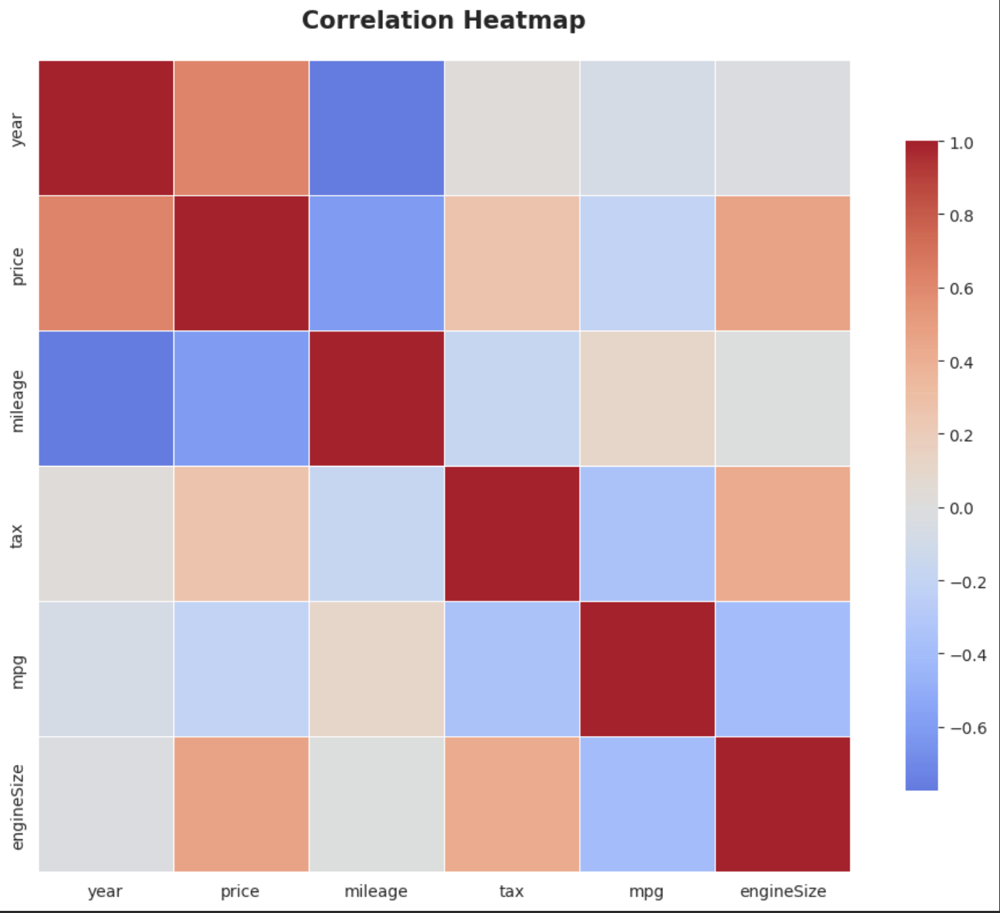
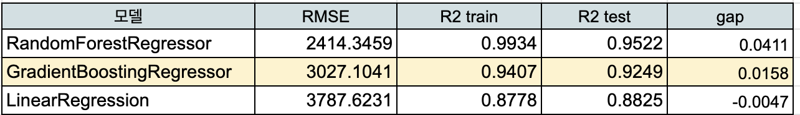
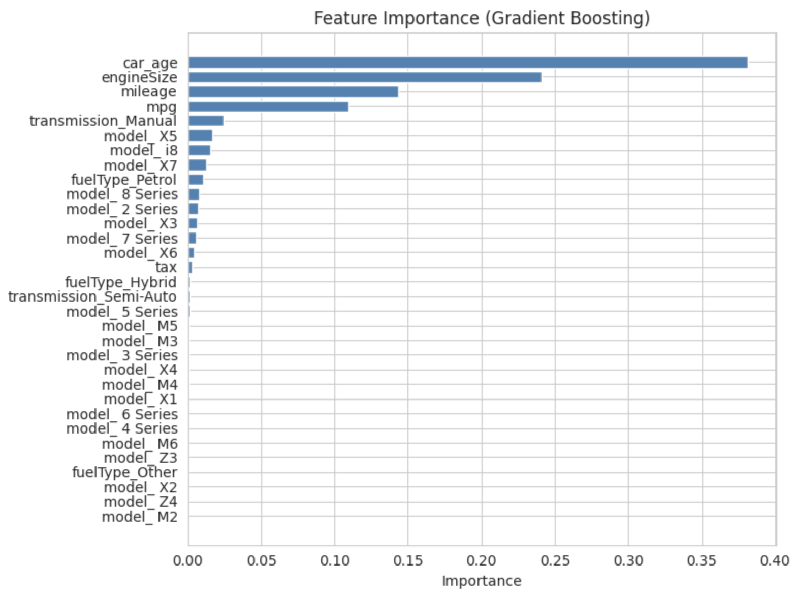

# BMW-Price-Prediction
BMW중고차량 가격 예측 머신러닝 모델링

---

## ✅ 배경 (Background)
최근 사회초년생인 동생이 중고차 구매를 고려하는 과정에서
차량의 연식, 주행거리, 모델 등에 따라
적절한 중고차량 가격을 판단하기 어렵다는 문제를 경험했습니다. 

이를 계기로 Kaggle 의 BMW 중고차 데이터를 활용해
머신러닝 기반 중고차량 가격 예측 모델을 구현해보았습니다. 

## 🎯 목표(Goal)

BMW 중고차 데이터의 주요 변수(연식, 주행거리, 엔진 크기 등)를 활용하여
차량 가격을 예측하는 머신러닝 모델을 구축하고 모델 성능을 비교합니다.

모델 성능을 고려한 뒤 가장 적합한 모델을 선정합니다.

---

## 🧱 Dataset
### Kaggle BMW Used Car Dataset​
* shape: 10,781 X 9​
* 수치형 변수: year(출고년도),  price(차량가격),  mileage(주행거리),  tax(자동차세),  mpg(연비),  engineSize(엔진크기)
* 범주형 변수: model(모델),   transmission(변속기),   fuelType(연료종류)
* 타깃 변수: price(가격)​

---

## 📊 분석 과정 (EDA + 전처리 + 모델링)
### EDA
1️⃣ 수치형 변수와 범주형 변수의 분포를 히스토그램을 활용하여 분석했습니다.
- 주요 변수의 분포 확인
- 가격(price) 변수의 분포 특성 분석
- 일부 변수에서 비대칭적인 분포 및 이상치 가능성 확인
  
이를 통해 데이터 전처리 방향을 설정했습니다.

2️⃣ 이상치 탐지를 위해 IQR(Interquartile Range) 기반 방법을 사용했습니다.
- Q1, Q3 계산
- IQR 범위 설정
- IQR 기준을 벗어나는 값을 이상치 후보로 탐지

변수 특성을 고려하여 **일괄적인 이상치 제거가 아닌 변수별 분포 특성을 반영한 선택적 이상치 처리** 전략을 적용했습니다.
- IQR 범위가 지나치게 좁은 변수 제외
- 추후 Feature Engineering을 고려한 변수는 이상치 제거 대상에서 제외
- 도메인 지식을 기반으로 가격이 음수인 데이터는 비정상 데이터로 판단하여 제거

3️⃣ Feature Engineering
차량 출고 연도(year) 변수는 차량 연식(car_age) 변수로 바꾸었습니다.

이는 차량 상태를 직관적으로 해석하기 위한 도메인 기반 Feature Engineering입니다.

4️⃣ 피어슨 상관계수와 히트맵으로 변수 간 상관관계를 파악했습니다.
분석 결과,
- 차량 연식이 최신일수록 가격이 높아지는 경향 (pcc=  0.6238)
- 주행거리가 짧을수록 가격이 높아지는 경향 (pcc=  -0.6054)
- 엔진 크기가 클수록 가격이 높아지는 경향 (pcc=  0.4602)

이러한 변수들이 가격 예측에 중요한 역할을 할 가능성을 확인했습니다.

### Data Preprocessing
데이터 누수를 방지하기 위해 Train/Test Split을 먼저 수행한 후 인코딩을 진행했습니다.
- Train/Test Split
- 범주형 변수 one-hot encoding
- 모델 학습 데이터 준비
  
### Model Training
가격 예측을 위해 다음 회귀 모델을 학습했습니다.
- Linear Regression
- Random Forest
- Gradient Boosting

### Model Evaluation
- RMSE
- R2 score
- gap (train R2 score 와 test R2 score 의 차이)

---

## 🧾 결과 (Result)
### 최종 선정 모델
Gradient Boosting

### 모델 성능 비교

비교 결과 Gradient Boosting 모델이
가장 낮은 과적합 수준을 보이며 안정적인 성능을 보여 최종 모델로 선정했습니다.

추가적으로 Random Forest 모델의 과적합을 완화하기 위해
트리 개수 등 하이퍼파라미터 튜닝을 실험적으로 수행했습니다.

### 가격(price)에 가장 큰 영향을 미치는 변수

Feature Importance 분석을 통해 모델이 예측에 활용한 주요 변수를 확인했습니다.
특히, **car_age(차량 연식), engineSize(엔진크기), mileage(주행거리)** 는
높은 중요도를 보이며 예측 성능에 핵심적인 역할을 하는 변수로 나타났습니다.
이러한 결과는 **EDA 단계에서 확인한 상관관계 분석 결과와도 일관된 경향**을 보입니다.

---

## ⚠️ 한계와 도약 (Limitations & Next Steps) ​
프로젝트를 진행하며 도메인 이해와 데이터 처리 기준을 명확히 세우는 것이 가장 중요함을 알게 되었습니다. 
특히 어떤 기준으로 이상치를 정의하고 제거할 것인지 결정하는 과정이 어려웠습니다.
단순히 모델 성능을 높이는 것보다 **도메인 맥락을 반영한 데이터 정제**가 필요했기 때문입니다.
**도메인을 이해하는 기획자와 기술을 담당하는 엔지니어 간 협업** 스킬 역시 갖추어서 의미 있는 데이터를 만들 것입니다.

향후에는
- 도메인 기준과 통계적 기준을 함께 적용한 이상치 처리 방법 비교
- 데이터 로드 → 정제 → 학습까지 이어지는 데이터 파이프라인 구축
을 통해 분석 과정을 더욱 체계적으로 발전시키고자 합니다.

---

## 🛠 기술스택 (Tech Stack)
Python, Google Colab, pandas, numpy, scikit-learn, matplotlib, seaborn
